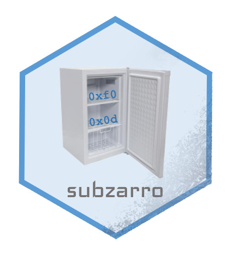

 

# subzarro
A subset of Zarr implemented in R

## Installation

Installation requires R 4.0.0 or greater.

```r
install.packages("devtools")
devtools::install_github("keller-mark/subzarro")
```

## Usage

```r
library(subzarro)

# TODO
```


## Development


```r
setwd("path/to/subzarro")
install.packages("devtools")
devtools::install()
devtools::load_all()
```

## Testing

```r
devtools::check()
devtools::test()
```

## Documentation

```r
install.packages("devtools")
install.packages("pkgdown")
devtools::document()
pkgdown::build_site()
```

## Resources

- [R packages](https://r-pkgs.org/)
- [roxygen2 syntax](https://cran.r-project.org/web/packages/roxygen2/vignettes/rd-formatting.html)
- [R6](https://r6.r-lib.org/index.html)
- [R6 roxygen2 syntax](https://www.tidyverse.org/blog/2019/11/roxygen2-7-0-0/#r6-documentation)
- [pkgdown](https://pkgdown.r-lib.org/)
- [Zarr](https://github.com/zarr-developers)
  - [LZ4 and ZSTD compression in R](https://github.com/traversc/qs)
